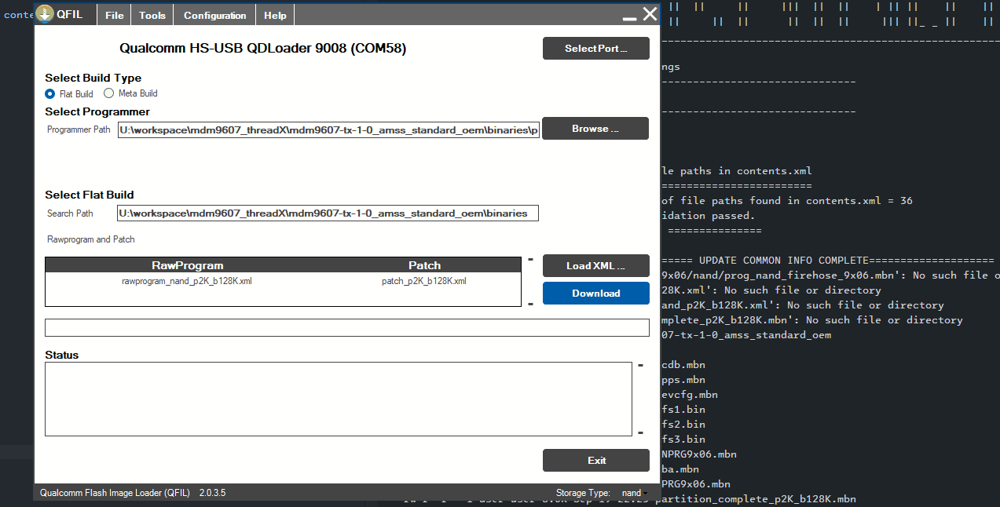
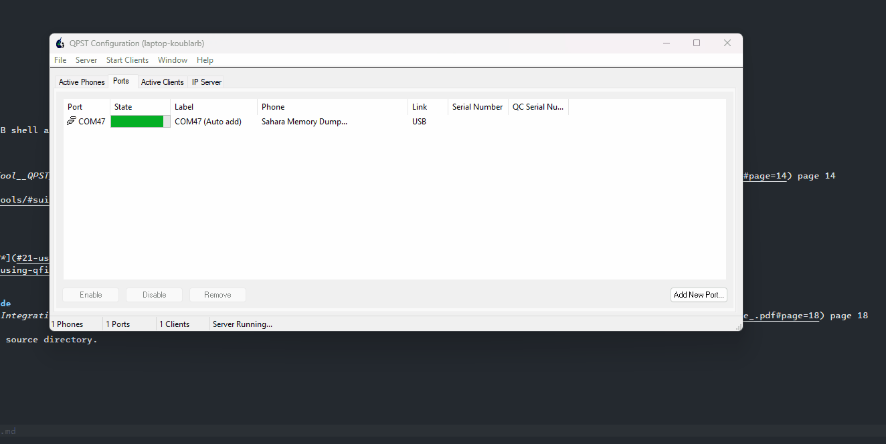

# Compile Guide
------------------------------------------------------------------------------------
- [Compile Guide](#compile-guide)
  - [1. Install Docker on Linux Host](#1-install-docker-on-linux-host)
  - [2. Download Prebuilt Docker image and Qualcomm Tools](#2-download-prebuilt-docker-image-and-qualcomm-tools)
    - [2.1 Import Docker image](#21-import-docker-image)
    - [2.2 Clone Qualcomm Tools](#22-clone-qualcomm-tools)
    - [2.3 Run docker container](#23-run-docker-container)
  - [3. Compile chipcode](#3-compile-chipcode)
    - [3.1 Build apps\_proc](#31-build-apps_proc)
    - [3.2 Build boot\_images](#32-build-boot_images)
    - [3.3 Build modem\_proc](#33-build-modem_proc)
    - [3.4 Build rpm\_proc](#34-build-rpm_proc)
    - [3.5 Build trustzone\_images](#35-build-trustzone_images)
    - [3.6 Get flat build](#36-get-flat-build)
- [Flash Guide](#flash-guide)
  - [1. Install QPST on Windows host PC](#1-install-qpst-on-windows-host-pc)
  - [2. Flash ThreadX](#2-flash-threadx)
    - [2.1 Using QFIL in Qualcomm HS-USB QDloader 9008 mode](#21-using-qfil-in-qualcomm-hs-usb-qdloader-9008-mode)
    - [2.2 Using QPST in Qualcomm HS-USB MDM Diagnostics 90B2 mode](#22-using-qpst-in-qualcomm-hs-usb-mdm-diagnostics-90b2-mode)
  - [3. Check log](#3-check-log)
    - [3.1 SBL boot log](#31-sbl-boot-log)
    - [3.2 ThreadX log](#32-threadx-log)
    - [3.3 Load ThreadX Demo image](#33-load-threadx-demo-image)

------------------------------------------------------------------------------------
## 1. Install Docker on Linux Host
- Refer Docker Engine on Ubuntu [here](https://docs.docker.com/engine/install/ubuntu/)

## 2. Download Prebuilt Docker image and Qualcomm Tools
- Qualcomm Tools: [Download](https://drive.google.com/file/d/1c5ZedP18aSO4WxufLkKP8nj7ru3grYrt/view?usp=drive_link)
### 2.1 Import Docker image

```sh
# New docker image version will be updated to docker hub, you can update by below command
cd $HOME
docker pull ivando0209/build-os:latest
# Check loaded docker image
docker image ls
```

### 2.2 Clone Qualcomm Tools

```sh
# Get Qualcomm_Tools path to be used in docker script
cd $HOME
git clone --depth=1 https://github.com/cavli-wireless/Qualcomm_Tools
```

### 2.3 Run docker container
- Run
```sh
cd $HOME
./run_container.sh
```

with below content.

```sh
#!/bin/bash

# Script name: run_container.sh

# Name of container
DOCKER_NAME=docker

# Username of host PC
HOST_USER=$USER

# Username of docker image
DOCKER_USER=user

# gitconfig on Host machine,
GIT_CONF=/home/$HOST_USER/.gitconfig
GIT_CRED=/home/$HOST_USER/.git-credentials

# SSH dir on Host machine
SSH_PATH=/home/$HOST_USER/.ssh

# Qualcomm_Tools that was extracted above
QC_TOOLS=/home/$HOST_USER/workspace/Qualcomm_Tools

# Your workspace folder
WORK_SPACE=/home/$HOST_USER/workspace

docker run --name $DOCKER_NAME -dit --privileged \
    -u $DOCKER_USER \
    -h $DOCKER_NAME \
    -v /dev/bus/usb/:/dev/bus/usb \
    -v /etc/localtime:/etc/localtime:ro  \
    -v $GIT_CONF:/home/$DOCKER_USER/.gitconfig \
    -v $GIT_CRED:/home/$DOCKER_USER/.git-credentials \
    -v $SSH_PATH:/home/$DOCKER_USER/.ssh \
    -v $WORK_SPACE:/home/$DOCKER_USER/workspace \
    -v $QC_TOOLS:/pkg \
    ivando0209/build-os  bash
```

## 3. Compile chipcode
- Clone source
  ```sh
  git clone --depth=1 git@github.com:cavli-wireless/C42QM_9205.git
  ```

- Run
  
  ```sh
  sudo ./build.all.sh
  ```

to compile [*apps_proc*](apps_proc), [*boot_images*](boot_images), [*modem_proc*](modem_proc), [*rpm_proc*](rpm_proc), [*trustzone_images*](trustzone_images), and **get meta build** at the same time or each parts as follows:


### 3.1 Build apps_proc
   ```sh
   sudo ./build.approc.sh
   ```
### 3.2 Build boot_images
   ```sh
   sudo ./build.boot.sh
   ```
### 3.3 Build modem_proc
   ```sh
   sudo ./build.mpss.sh
   ```
### 3.4 Build rpm_proc
   ```sh
   sudo ./build.rpm.sh
   ```
### 3.5 Build trustzone_images
   ```sh
   sudo ./build.tz.sh
   ```
### 3.6 Get flat build
   ```sh
   sudo ./get_metabuid.sh
   # output files in binaries directory and zip file
   ```

# Flash Guide
- ThreadX is RTOS, is not a feature-rich HLOS like Linux.  ADB shell and Serial Console are not supported

## 1. Install QPST on Windows host PC
Refer document: [*80-V1400-3_REV_N_Qualcomm_Product_Support_Tool__QPST__2_7_.pdf*](https://docs.qualcomm.com/bundle/80-V1400-3/resource/80-V1400-3_REV_N_Qualcomm_Product_Support_Tool__QPST__2_7_.pdf#page=14) page 14

- Download QPST [here](https://createpoint.qti.qualcomm.com/tools/#suite/285/46220)
- Double click and install downloaded file.

## 2. Flash ThreadX
- [Qualcomm HS-USB MDM Diagnostics 90B2 : *VID_05C6, PID_90B2*](#21-using-qpst-in-qualcomm-hs-usb-mdm-diagnostics-90b2-mode)
- [Qualcomm HS-USB QDloader 9008 : *VID_05C6, PID_9008*](#22-using-qfil-in-qualcomm-hs-usb-qdloader-9008-mode)

### 2.1 Using QFIL in Qualcomm HS-USB QDloader 9008 mode

- QFIL flash binary files in [*binaries*](binaries) directory.



### 2.2 Using QPST in Qualcomm HS-USB MDM Diagnostics 90B2 mode
- Refer document: [*80-P8101-6_REV_B_MDM9206_ThreadX_Build_and_Integration_Guide_.pdf*](https://docs.qualcomm.com/bundle/80-P8101-6/resource/80-P8101-6_REV_B_MDM9206_ThreadX_Build_and_Integration_Guide_.pdf#page=18) page 18

- File ```contents.xml``` is the [*contents.xml*](contents.xml) in chipcode source directory.



## 3. Check log
### 3.1 SBL boot log
- Open USB Serial port, baudrate 115200, data bit 8, parity None, stop bit 1, no flow control

```
Format: Log Type - Time(microsec) - Message - Optional Info
Log Type: B - Since Boot(Power On Reset),  D - Delta,  S - Statistic
S - QC_IMAGE_VERSION_STRING=BOOT.XF.0.2-00111-MDM9x05LZB-2
S - IMAGE_VARIANT_STRING=Mdm9x05LA
S - OEM_IMAGE_VERSION_STRING=crm-ubuntu47
S - Boot Interface: SPI NAND
S - Secure Boot: Off
S - Boot Config @ 0x000a6070 = 0x00000041
S - JTAG ID @ 0x000a6130 = 0x001070e1
S - OEM ID @ 0x000a6138 = 0x00000000
S - Serial Number @ 0x000a6134 = 0xd81cd0d6
S - OEM Config Row 0 @ 0x000a41b0 = 0x0000000000000000
S - OEM Config Row 1 @ 0x000a41b8 = 0x0000000000000000
S - Feature Config Row 0 @ 0x000a41c8 = 0x0405050000000000
S - Feature Config Row 1 @ 0x000a41d0 ½ 0x0242f80400000609
S - Core 0 Frequency, 0 MHz
S - PBL Patch Ver: 4
S - I-cache: On
S - D-cache: On
B -       285 - PBL, Start
B -      4926 - bootable_media_detect_entry, Start
B -      5995 - bootable_media_detect_success, Start
B -      6316 - elf_loader_entry, Start
B -      7303 - auth_hash_seg_entry, Start
B -      8288 - auth_hash_seg_exit, Start
B -     36959 - elf_segs_hash_verify_entry, Start
B -     42639 - elf_segs_hash_verify_exit, Start
B -     42944 - auth_xbl_sec_hash_seg_entry, Start
B -     63206 - auth_xbl_sec_hash_seg_exit, Start
B -     63207 - xbl_sec_segs_hash_verify_entry, Start
B -     64546 - xbl_sec_segs_hash_verify_exit, Start
B -     64582 - PBL, End
B -     67312 - SBL1, Start (MPM timestamp = 77256)
B -    219799 - sbl1_ddr_set_default_params, Start
D -        27 - sbl1_ddr_set_default_params, Delta
B -    228279 - boot_config_data_table_init, Start
D -    212588 - boot_config_data_table_init, Delta - (0 Bytes)
B -    445420 - CDT Version:3,Platform ID:34,Major ID:1,Minor ID:0,Subtype:0
B -    449761 - pm_device_init, Start
B -    457935 - PM: PON REASON: PM0=0x8000028000000001:0x0
B -    472556 - PM: SET_VAL:Skip
D -     17082 - pm_device_init, Delta
B -    474485 - pm_driver_init, Start
D -      2200 - pm_driver_init, Delta
B -    481169 - pm_sbl_chg_init, Start
D -   3150510 - pm_sbl_chg_init, Delta
B -   3635082 - vsense_init, Start
D -         0 - vsense_init, Delta
B -   3640615 - Pre_DDR_clock_init, Start
D -       318 - Pre_DDR_clock_init, Delta
D -         0 - sbl1_ddr_set_params, Delta
B -   3652485 - do ddr sanity test, Start
D -         0 - do ddr sanity test, Delta
B -   3658698 - pm_driver_init, Start
D -      2025 - pm_driver_init, Delta
B -   3665815 - vsense_init, Start
D -         0 - vsense_init, Delta
B -   3681437 - clock_init, Start
D -       103 - clock_init, Delta
B -   3683373 - boot_flash_init, Start
D -      2485 - boot_flash_init, Delta
B -   3690194 - Image Load, Start
D -      1597 - Auth Metadata
D -      7017 - OEM_MISC Image Loaded, Delta - (7424 Bytes)
B -   3699511 - Image Load, Start
D -      5056 - APDP Image Loaded, Delta - (0 Bytes)
B -   3708086 - PM: 0: PON=0x1:HARD_RESET: ON=0x80:PON_SEQ: POFF=0x2:PS_HOLD: OFF=0x80:POFF_SEQ
B -   3712270 - sbl1_efs_handle_cookies, Start
D -        11 - sbl1_efs_handle_cookies, Delta
B -   3725021 - Image Load, Start
D -      3763 - QTI_MISC Image Loaded, Delta - (0 Bytes)
B -   3731901 - Image Load, Start
D -      1701 - Auth Metadata
D -     10697 - QSEE Dev Config Image Loaded, Delta - (30224 Bytes)
B -   3743010 - Image Load, Start
D -      1497 - Auth Metadata
D -      9461 - SEC Image Loaded, Delta - (6840 Bytes)
B -   8474537 - pmic misc register imem initial value: 0
B -   8475220 - Image Load, Start
D -      1647 - Auth Metadata
D -     18593 - RPM Image Loaded, Delta - (162532 Bytes)
B -   8493947 - Image Load, Start
D -      3891 - STI Image Loaded, Delta - (0 Bytes)
B -   8500785 - Image Load, Start
D -      4776 - Tiny Image Loaded, Delta - (0 Bytes)
B -   8508425 - Image Load, Start
D -      2447 - Auth Metadata
D -    795089 - MPSS Image Loaded, Delta - (11397894 Bytes)
B -   9303547 - Image Load, Start
D -      1824 - Auth Metadata
D -    225717 - APPS Image Loaded, Delta - (3208624 Bytes)
B -   9529289 - Image Load, Start
D -     22265 - Auth Metadata
D -     90100 - QSEE Image Loaded, Delta - (837320 Bytes)
B -   9619711 - SBL1, End
D -   9556093 - SBL1, Delta
S - Flash Throughput, 18000 KB/s  (15651114 Bytes,  868711 us)
S - DDR Frequency, 336 MHz
```

### 3.2 ThreadX log
- Get RAMPDUMP log


- [Refer QFLOG](https://docs.qualcomm.com/bundle/80-P8101-33/resource/80-P8101-33_REV_J_LTE_IOT_SDK_User_Guide_for_MDM.pdf#page=13)

### 3.3 Load ThreadX Demo image
- [ThreadX Downloadable Application](https://docs.qualcomm.com/bundle/80-P8101-12/resource/80-P8101-12_REV_H_MDM9206_ThreadX_Downloadable_Application_Module_User_Guide.pdf#page=26)

- [Qcli demo](https://docs.qualcomm.com/bundle/80-P8101-1/resource/80-P8101-1_REV_B_MDM9206_BSP_ThreadX_Overview.pdf#page=21)
